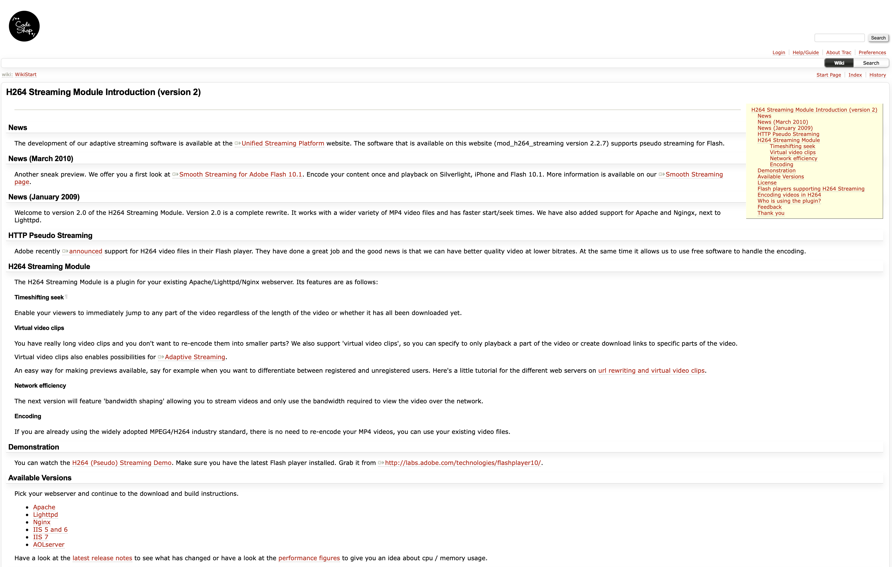

# H264 Streaming Module Introduction (version 2)

## News

The development of our adaptive streaming software is available at the
[Unified Streaming Platform](http://www.unified-streaming.com) website. The
software that is available on this website (mod_h264_streaming version 2.2.7)
supports pseudo streaming for Flash. 

## News (March 2010)

Another sneak preview. We offer you a first look at Smooth Streaming for Adobe
Flash 10.1. Encode your content once and playback on Silverlight, iPhone and
Flash 10.1. 

## News (January 2009)

Welcome to version 2.0 of the H264 Streaming Module. Version 2.0 is a complete
rewrite. It works with a wider variety of MP4 video files and has faster
start/seek times. We have also added support for Apache and Nginx, next to
Lighttpd.

## HTTP Pseudo Streaming

Adobe recently [announced](http://www.adobe.com/aboutadobe/pressroom/pressreleases/200712/120407adobemoviestar.html)
support for H264 video files in their Flash player. They have done a
great job and the good news is that we can have better quality video at lower
bitrates. At the same time it allows us to use free software to handle the
encoding.

## H264 Streaming Module

The H264 Streaming Module is a plugin for your existing Apache, IIS, Lighttpd
or Nginx webserver. Its features are as follows:

### Timeshifting seek

Enable your viewers to immediately jump to any part of the video regardless of
the length of the video or whether it has all been downloaded yet.

### Virtual video clips

You have really long video clips and you don't want to re-encode them into
smaller parts? We also support 'virtual video clips', so you can specify to only
playback a part of the video or create download links to specific parts of the
video.

### Network efficiency 

The next version will feature 'bandwidth shaping' allowing you to stream videos
and only use the bandwidth required to view the video over the network.

### Encoding

If you are already using the widely adopted MPEG4/H264 industry standard, there
is no need to re-encode your MP4 videos, you can use your existing video files.

## Available Versions

Pick your webserver and continue to the download and build instructions.

  * [AOLserver](webserver/aolserver.md)
  * [Apache](webserver/apache.md)
  * [IIS 5 and 6](webserver/iis-5-6.md)
  * [IIS 7](webserver/iis-7.md)
  * [Lighttpd](webserver/lighttpd.md)
  * [Nginx](webserver/nginx.md)

Have a look at the [latest release notes](webserver/release_notes.md) to see 
what has changed or have a look at the 
[performance figures](webserver/performance/nginx.md) to give you an idea about 
cpu / memory usage.

## License

This version is free if you agree to the
[noncommercial license](http://creativecommons.org/licenses/by-nc-sa/3.0).
Please mention its use on your website, in the lines of 'This website uses H264
pseudo video streaming technology by [CodeShop](http://h264.code-shop.com)'.

Our commercial license is very inexpensive, see the following page to check if
you need a [license](License.md).

## Flash players supporting H264 Streaming

  * [FCPlayer](http://www.fastcatsoftware.com/Player/H264Streaming/demo.asp)
  * [JW FLV Media Player](http://www.longtailvideo.com/players/jw-flv-player)
  * [Flowplayer](http://www.flowplayer.org/)

## Encoding videos in H264

See the article [Encoding video in H264](webserver/encoding.md).

## Feedback

Feel free to email us at h264[at]code-shop.com private comment.

## Thank you

A big thank you goes out to Tinic Uro and the people on the
http://www.jeroenwijering.com forum for providing the necessary reading,
articles and links.

