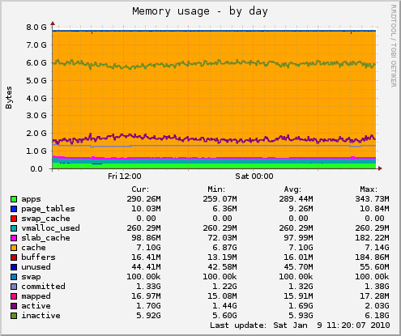

# Performance of the H264 Streaming Module (version 2)

## Setup 1 

  - Nginx 0.7.64 
  - mod_h264_streaming 2.2.7
  - Centos 5.3
  - Quadcore Xeon  X3220  @ 2.40GHz
  - 8G RAM
  - 2x 300G 15k SAS hardware Raid0

At 280 connections and pushing 180Mbit it takes on average 17% CPU on just one 
of the four cores.

